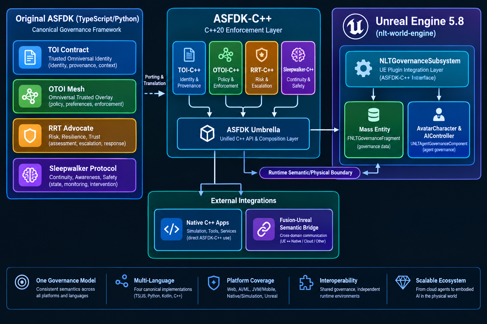
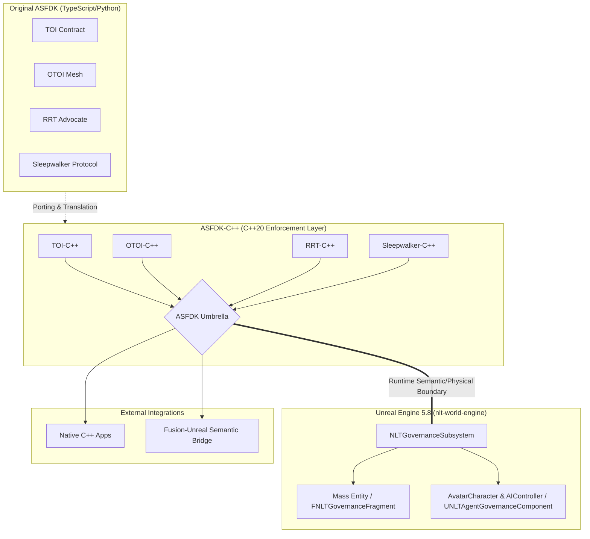

# ASFDK C/C++ Governance

**ASFDK Solidarity Framework port to C/C++** — providing TOI/OTOI/ASFDK compliance for C/C++ ecosystems, including Unreal Engine C++ and native C++ application integration.

## Repository Overview

This is the C/C++ port of the NeuroLift Technologies ASFDK (Solidarity Framework Development Kit), enabling governance-aware AI systems in the C and C++ ecosystems.

**Document ID:** ORG-DEV-OTOI-1.0.3
**Governed by:** Solidarity Framework | HAIEF
**Related repositories:**
- `NeuroLift-Technologies/asfdk` — Original ASFDK (Python/TypeScript)
- `NeuroLift-Technologies/asfdk-kotlin` — Kotlin port
- `NeuroLift-Technologies/asfdk-csharp` — C#/.NET port
- `NeuroLift-Technologies/asfdk-harness` — ASFDK harness/runtime

## Architecture





## Structure

```
asfdk-cplus/
├── CMakeLists.txt              # Root CMake project (Phase 6 umbrella build)
├── vcpkg.json                 # vcpkg dependency manifest (DECISIONS.md §4)
├── AGENTS.md                  # Agent registry (2 agents: governance + Unreal bridge)
├── CLAUDE.md                  # Agent session directives
├── NLT-DEV-OTOI.md            # Org-level governance contract
├── nltotoi.json               # Discovery manifest
├── REVIEW.md                  # Canonical agent review format
├── templates/                 # OTOI Section 3 formats
│   ├── agent-registration.json
│   ├── handoff-record.json
│   ├── escalation.md
│   └── intent-log.md
├── ISSUE_TEMPLATE/            # GitHub issue forms
├── PULL_REQUEST_TEMPLATE/     # PR checklist
├── SOPs/                      # Standard operating procedures
├── .github/workflows/         # CI governance validation
│   └── validate-governance.yml
├── packages/                  # Pillar packages
│   ├── asfdk/                 # Phase 6: ASFDK umbrella (composition layer)
│   ├── toi/                   # Phase 2: Terms of Interaction
│   ├── otoi/                  # Phase 3: OTOI charter management
│   ├── rrt-advocate/          # Phase 4: RRT Advocate
│   └── sleepwalker/           # Phase 5: Sleepwalker Protocol
└── .nltotoi/                  # Namespace structure
    ├── README.md
    ├── index/
    │   └── governance-files.md
    ├── agent-registration.json
    └── scripts/
        └── validate-governance.sh
```

## Build

This system does not have cmake installed. Use the hermetic g++ build instead:

```sh
# Hermetic build (no cmake needed) — g++ 15.2.0 is preinstalled
g++ -std=c++23 -I packages/asfdk/include -I packages/toi/include \
    -I packages/otoi/include -I packages/rrt-advocate/include \
    -I packages/sleepwalker/include -I packages/include \
    packages/asfdk/tests/standalone_test.cpp packages/asfdk/src/ASFDK.cpp \
    packages/toi/src/TermsOfInteraction.cpp packages/otoi/src/OTOIManager.cpp \
    packages/rrt-advocate/src/*.cpp packages/sleepwalker/src/*.cpp \
    -o /tmp/asfdk_test && /tmp/asfdk_test
```

All 37/37 checks pass, exit 0.

## Quick Start

```bash
# Validate governance compliance
bash .nltotoi/scripts/validate-governance.sh

# All 22 checks pass when properly configured
```

## Phase 6 — ASFDK Umbrella

The ASFDK umbrella (`packages/asfdk/`) composes all four pillars into a single unified C++23 interface.

**Build:**

Prerequisites: [vcpkg](https://github.com/microsoft/vcpkg) installed and `VCPKG_ROOT` environment variable set.

```sh
# Configure (with vcpkg toolchain)
cmake -B build -DCMAKE_TOOLCHAIN_FILE="$VCPKG_ROOT/scripts/buildsystems/vcpkg.cmake"

# Build
cmake --build build

# Test
ctest --test-dir build
```

**Hermetic smoke test** (no cmake/Catch2 needed):

```sh
g++ -std=c++23 -I packages/asfdk/include -I packages/toi/include \
    -I packages/otoi/include -I packages/rrt-advocate/include \
    -I packages/sleepwalker/include -I packages/include \
    packages/asfdk/tests/standalone_test.cpp \
    packages/asfdk/src/ASFDK.cpp \
    packages/toi/src/*.cpp packages/otoi/src/OTOIManager.cpp \
    packages/rrt-advocate/src/*.cpp packages/sleepwalker/src/*.cpp \
    -o /tmp/asfdk_test && /tmp/asfdk_test
**Layout:**

```
packages/asfdk/
├── include/asfdk/
│   ├── ASFDK.h          # ASFDK class — all pillar surfaces + unified surface
│   └── ASFDKTypes.h     # ProcessedInteraction, AssessmentResult, FoundationStatus, ASFDKError
├── src/
│   └── ASFDK.cpp        # delegation wiring + integration-layer logic
├── tests/
│   └── standalone_test.cpp
└── README.md
```

**What the umbrella adds:**

1. **D4 provenance envelope** (`process`) — normalises the interaction channel and marks the envelope `trusted` only for `user_input`.
2. **Flagging** (`ProcessedInteraction`) — combines Sleepwalker protective state, check-in requirements, and crisis indicators into one `flagged` + `flag_reason` signal.
3. **RRT handoff** (`assess`) — when Sleepwalker detects a state that requires RRT handoff, the umbrella invokes the RRT Advocate for crisis assessment.
4. **Composite status** (`getStatus`) — folds TOI, OTOI mode, RRT monitoring, and Sleepwalker activeness into one `FoundationStatus` with an `overall` health string.

## Agent Registration

All agents must self-register per OTOI Section 3. Store registration in `docs/agent-log/registrations/` or log to the active thread record.

See `templates/agent-registration.json` for the registration format.

## Governance Validation

Run the validation script to verify all governance files are present and valid:

```bash
bash .nltotoi/scripts/validate-governance.sh
```

Expected output: `✅ Governance validation PASSED — all 22 checks OK`

## Integration Targets

**NLTGovernanceSubsystem Integration:**
- Unreal Engine C++ governance subsystem
- Native C++ application boundaries
- Fusion ↔ Unreal semantic/physical reality bridge
- Mass Entity governance compliance

## Related Projects

- **asfdk** — Original ASFDK (Python/TypeScript)
- **asfdk-kotlin** — Kotlin port
- **asfdk-csharp** — C#/.NET port (sister repo)
- **asfdk-cplus** — This repo: C/C++ port
- **asfdk-harness** — ASFDK runtime/control plane

## License

Internal use only — NeuroLift Technologies organization.
